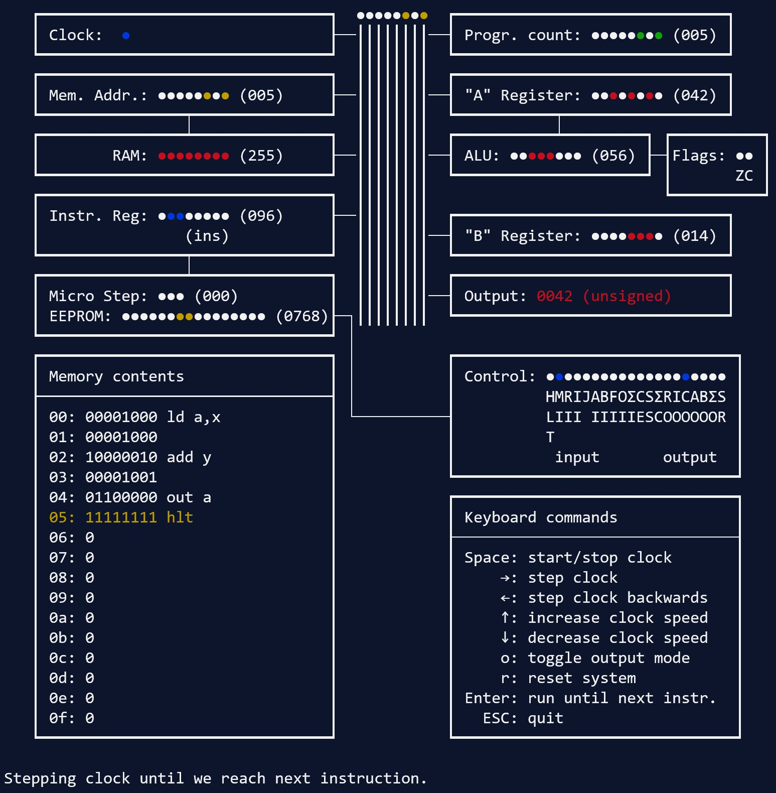

8bit breadboard computer simulator (extended memory)
====================================================

This is an assembler + simulator/emulator of [Ben Eater's 8bit breadboard computer](https://www.youtube.com/playlist?list=PLowKtXNTBypGqImE405J2565dvjafglHU) with its RAM upgraded to 256 bytes following the instructions by [/u/MironV](https://www.reddit.com/r/beneater/comments/h8y28k).

For Ben Eater's original architecture, see the [main branch](https://github.com/wmvanvliet/8bit/tree/main) of this repo.

This is an assembler + simulator/emulator of [Ben Eater's 8bit breadboard computer](https://www.youtube.com/playlist?list=PLowKtXNTBypGqImE405J2565dvjafglHU).

For a version with its RAM upgraded to 256 bytes following the instructions by [/u/MironV](https://www.reddit.com/r/beneater/comments/h8y28k), see, see the [ext_memory branch](https://github.com/wmvanvliet/8bit/tree/ext_memory) of this repo.




Installation
------------
Either clone the respository, or [download the code](https://github.com/wmvanvliet/8bit/archive/refs/heads/main.zip). On windows, you'll also need the [`windows-curses`](https://pypi.org/project/windows-curses/) package to display the user interface (on other platforms, `curses` is included in the standard lib).

Usage
-----
Write your test program in assembler and run it through the simulator.
```
python simulator.py test.asm
```

If you want a closer look at the assembler output:
```
python assembler.py test.asm
```


Programming the computer using assembly language
------------------------------------------------

This simulator reads its memory contents from a text file with the `.asm` extension. The file should contain programming code written in assembler.

Supported assembler instructions:

```
nop     No operation
lda #   Load memory contents at # into register A
add #   Add memory contents at # to register A
sub #   Subtract memory contents at # from register A
sta #   Store contents of register A at memory location #
ldi #   Load the value # into register A
jmp #   Jump to memory location #
jc #    Jump to memory location # if the carry flag is set
jz #    Jump to memory location # if the zero flag is set
out     Output contents of register A
hlt     Halt the CPU, end of program
```

The assembler also supports comments using the `;` character, writing raw values with `db` and labels. Here is an example assembler program that uses all the features of the assembler:
```asm
;
; Test program that adds two numbers
;
	lda a  ; Load the memory contents at the (a) label into register "A".
	add b  ; Add the memory contents at the (b) label to the value in register "A".
	out    ; Display the value in register "A" on the 7-segment display.
	hlt    ; Halt the clock. This signals the end of the program.

a:         ; Label that marks memory location (a)
	db 28  ; Write the literatal value "28" at this memory location.
b:         ; Label that marks memory location (b)
	db 14  ; Write the literal value "14" at this memory location.
